## Hi there 👋

## 📊 GitHub Stats

  

  
  

## 🐍 My Contributions

<picture>
  <source media="(prefers-color-scheme: dark)"
    srcset="https://raw.githubusercontent.com/sravankumargandhe15-png/Gandhe-Sravan-Kumar/output/github-snake-dark.svg">

  <source media="(prefers-color-scheme: light)"
    srcset="https://raw.githubusercontent.com/sravankumargandhe15-png/Gandhe-Sravan-Kumar/output/github-snake.svg">

  
</picture>
## 🔗 Connect with me

&nbsp;&nbsp;
&nbsp;&nbsp;

<!--
**sravankumargandhe15-png/sravankumargandhe15-png** is a ✨ _special_ ✨ repository because its `README.md` (this file) appears on your GitHub profile.

Here are some ideas to get you started:

- 🔭 I’m currently working on ...
- 🌱 I’m currently learning ...
- 👯 I’m looking to collaborate on ...
- 🤔 I’m looking for help with ...
- 💬 Ask me about ...
- 📫 How to reach me: ...
- 😄 Pronouns: ...
- ⚡ Fun fact: ...
-->
